# Pocket Monsters Red, Green, and Blue in English

**pocketrgb-english** serves as a dissassembly base, based on the Japanese releases of the Generation 1 Pocket Monsters games.
Based off of Masaru2's work on pokejp the goal of **pocketrgb-english** is to act as more of a "translation" and less of a localization. Masaru2's work has been great but I am surprised no one has made a version of RGB with Japanes names. Pokejp changes all the text and pokedex entries to match, but they are skipping all the pokemon and character names. So I will be going through each Pokemon and Character and replace their names with the closest Hepburn and Romaji versions that will fit. This way I can enjoy the Drunken man with original names while I play the closest thing to a "translation" of the Japanese versions that I can manage!

It builds the following ROMs:

* Pocket Monsters - Red Version (Canada, Japan) (SGB Enhanced).gb 
* Pocket Monsters - Green Version (Canada, Japan) (SGB Enhanced).gb  
* Pocket Monsters - Blue Version (Canada, Japan) (SGB Enhanced).gb 

As well as these with DEBUG=1:
* pocketred_debug.gb
* pocketgreen_debug.gb
* pocketblue_debug.gb 

## Downloading and playing - No Current Patch
In the case of simply wanting to play generation 1 as it was released in Japan, download the .bps patch files from the [patches](patches) folder, and use a tool like [Lunar IPS](http://fusoya.eludevisibility.org/lips/) (for Windows), [Rompatcher.js](https://www.marcrobledo.com/RomPatcher.js/), [MultiPatch](http://projects.sappharad.com/tools/multipatch.html) (for OS X), or [UniPatcher](https://play.google.com/store/apps/details?id=org.emunix.unipatcher&hl=en) (for Android) to apply the patch to the correct ROM.

These are the roms you should use for each version:

**Red**
- Pokemon Red (UE) [S][!].gb `sha1: ea9bcae617fdf159b045185467ae58b2e4a48b9a`

**Green and Blue**
- Pokemon Blue (UE) [S][!].gb `sha1: d7037c83e1ae5b39bde3c30787637ba1d4c48ce2`

They're based off of the ones made by the [pokered](https://github.com/pret/pokered) project.

## Setting up your own

To set up the repository for your own editing purposes, see [**INSTALL.md**](INSTALL.md).

## Why make this?

In 1996, The original Pocket Monsters Red and Green were released. Later that Year, Pocket Monsters Blue was released as well. In the west, 2 years later, Pokémon Red and Blue were released, using the updated Pocket Monsters Blue as the base engine. A Pokémon game with Pocket Monsters Blue's wild data was never released in Japan. This caused a multitude of changes in the International releases of Red and Blue. This ROM hack serves to create English Versions of those Japanese releases, the closest as possible.

## What's changed?

* The title screens have been changed to match the Japanese releases. (Exceptions Slide Animation For Red and Green and the Whoosh are still missing)
* Restored Japanese SGB Palettes and Boarders (Slight tweaks: Blue - Aligned pokeball shadows to a center glow rather then all over the place, Red - Kept the word "Red" centered rather then making it off center like jp)
* Any bugs present in the original Red and Green that are not in International Red and Blue are not present and viceversa.
* Pocket Monsters Blue Version's wild Pokémon data has been edited to the Japanese release. Pocket Monsters Green Version uses US Blue's wild data.
* Pocket Monsters Red and Green now use the original Cerulean Cave layout.
* Pocket Monsters Red and Green use their Overworld and Pokémon graphics from their original release.
* Pocket Monsters Green Version loads its unique Super Game Boy Palette.
* Fixed Glitch where Haunters from in-game trades wouldn't evolve.
* Fixed The "Presents" Under the Game Freak logo not appearing where its supposed to.
* Restores the original flashing lights for the moves "Thunderbolt" and "Hyper Beam".
* Original map border layout from the japanese version restored.
* Translated Red and Green Pokédex entries.
* Gym leader names in the trainer card are restored.

## Screenshots

**Pocket Monsters - Red Version**

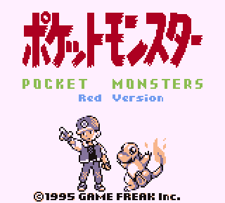
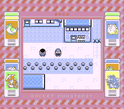
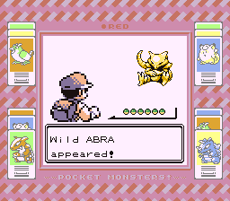
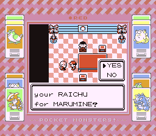
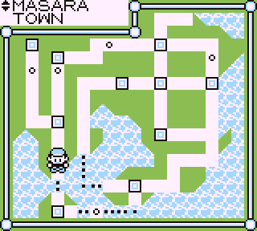

**Pocket Monsters - Green Version**

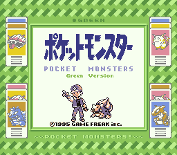
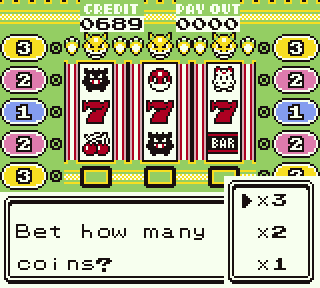
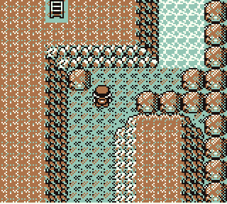
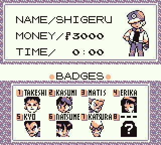

**Pocket Monsters - Blue Version**

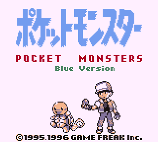
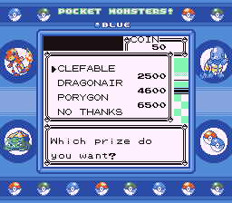
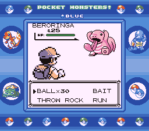
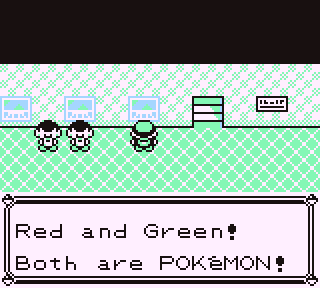

## To-do
* Fix MissingNo. not having the correct graphics, if possible. This could potentially also fix MissingNo. corrupting Hall of Fame data.
* Restore the title screen scrolling for R/G
* Restore the title screen Woosh scrolling sfx
* Repoint Celadon City poster text to add the missing puntuation mark
* Fix text box boarders to match jp releases
* Compare and replace non-matching blocks of the Unknown Dungeon map
* Port item type and coordinates
* Replace Mewtwo coordinates
* Swap the trade Nidoran(m) to (f) and changed the nickname to the one used in the jp release (CHAPPY)
* Port the save sound effect from Green.

## To-Verify
* Censorship is all Removed (drunk Old Man, praying man at the museum, the Tunguska incident Scientist)...
* References removed from the official translation are Restored (Kanto map, Myracle-Cycle bike store, Pokémon mansion journals written in singular and its last entry)...
* Check trainer lines and other text against Montblanc's Binary hack? https://www.romhacking.net/hacks/876/
* The Blue version script texts for the in-game trades (evolving Raichu)...
* The entire Pokédex has ben rewritten using the official translation from Fire red, but restoring some references like Cloyster enduring a napalm bomb or Ponyta jumping the whole Tokyo Tower
* Pokémon version name at the credits have been replaced, and centered
* Pokémon scrolling speed
* Bulbasaur starts moving at the beginning of the title music after the introduction notes
* Town Map border tiles were restored
* Aerodactyl and Kabutops fossil sprites Ported from jp
* Flower animation code was ported
* Original wild mon battle tile detection behavior restored, removing the Old Man glitch that never happened in the jp release
* Saffron City guards detecting any object as a drink fixed

## Credits

* Montblanc and ShaneM for their rom hacks that got me trying to do this and have been a constant refrence
* MoriyaFaith for his original pokejp project and Masaru2 for his fork
* [pokered](https://github.com/pret/pokered) for serving as a base dissassembly
* Alchav's fork of pokered, which allowed usage of the RG sprites
* Rangi42 for creating Tilemap Studio and Polished Map, allowing for editing of tilemaps, Cerulean Cave and the Japanese Map Border Layout
* Satomew for fixing the 2x2 tile glitch
* Jojobear13 for the trainer card restoration code and the R/G Shooting Star SFX code
