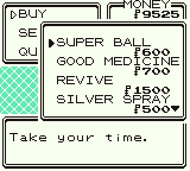
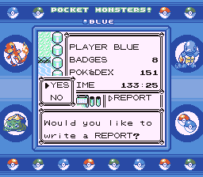

# Pocket Monsters - Red, Green, and Blue Version

## Translation > Localization
**pocketrgb-en**  is a Gen 1 disassembly, based on the Japanese releases titled 'Pocket Monsters' shortened to Pokémon.
The goal was to create the best 1 to 1 translation of the Japanese games that I could manage since none exist to date! Many have made "Uncensored" or what I like to consider improved "Localization" where they restore the dialog mostly and and really good ones like pokejp (the base **pocketrgb-en** is forked from) will also restore 99% of the visual elements except the Japanese version of the Logo. Now while these are nice I found they failed to give me any substantial sense of change to make me want to play them. As such I often felt like they should be paying more homage to the original source material if they really wanted to call themselves a translation. 

Enter **pocketrgb-en** where I have taken the time to compare videos of the intro's and screenshots of the games to pixel perfectly match the colors and timing of the original Japanese games. I also went on a massive bug hunt and solved a slew of common issues. With the cherry on top being my real pride of the project which is having replaced EVERY Pokémon, Character, Place and Badges name to translations of those used in the original releases.

If you have ever wanted to re-experience the joys and wonders of Gen 1 like you never have before join us in **pocketrgb-en**. Where you will relearn the names of your favourite Pokémon and Places. While fighting old rivals and gym leaders. All with new and unexpected names. Each interaction gains new life as you see the many references and details lost in even the localization of names!!

It builds the following ROMs:

* Pocket Monsters - Red Version (Canada, Japan) (SGB Enhanced).gbc 
* Pocket Monsters - Green Version (Canada, Japan) (SGB Enhanced).gbc  
* Pocket Monsters - Blue Version (Canada, Japan) (SGB Enhanced).gbc 

As well as these with DEBUG=1:
* pocketred_debug.gbc
* pocketgreen_debug.gbc
* pocketblue_debug.gbc

## Screenshots

**Pocket Monsters - Red Version**

**Pocket Monsters - Green Version**

**Pocket Monsters - Blue Version**

## What's changed?

Japanese Restoration:
* Completely Restored the Japanese releases Title Screens right down to Copyright dates and capitalization differences.
* Compared timing of Intro and Title to be frame accurate to the Japanese Releases
* Restored the title screen scrolling and Woosh sfx for R/G
* Restored the "Presents" Under the Game Freak logo.
* Restored Japanese SGB Palettes and Boarders (Slight tweaks: Blue - Aligned pokéball shadows to a centre glow rather then all over the place, Red - Kept the word "Red" centred rather then making it off centre like jp)
* Pocket Monsters Blue Version's wild Pokémon data has been edited to the Japanese release. Pocket Monsters Green Version uses US Blue's wild data.
* Pocket Monsters Red and Green now use the original Cerulean Cave layout.
* Pocket Monsters Red and Green use their Overworld and Pokémon graphics from their original release.
* Fixed Glitch where Haunters from in-game trades wouldn't evolve.
* Restores the original flashing lights for the moves "Thunderbolt" and "Hyper Beam".
* Restored the original map border layout from the Japanese versions.
* Pokédex rewritten using the official translation from Fire Red, but with restored references like Cloyster enduring a napalm bomb or Ponyta jumping the whole Tokyo Tower
* Censorship Removed (drunk Old Man, praying man at the museum, the Tunguska incident Scientist)...
* References removed from the official translation are Restored (Kanto map, Myracle-Cycle bike store, Pokémon mansion journals written in singular and its last entry)...
* Checked trainer lines and other text against Montblanc's Binary hack https://www.romhacking.net/hacks/876/
* Gym leader names in the trainer card are restored.
* Restored text box boarders from Japanese releases
* Restored Flower animations for Red and Green
* Swap the trade Nidoran(m) to (f) and changed the nickname to the one used in the jp release (CHAPPY)
* All other trade Pokémon nicknames were restored to English translations of the ones used in the Japanese releases
* Blue version script fixed for the in-game trades (evolving Raichu, etc.)
* Pokémon version name in the credits have been replaced
* Aerodactyl and Kabutops fossil sprites Ported from the Japenese releases
* Replaced Character names with the Romaji names from Bulbapedia (https://bulbapedia.bulbagarden.net/wiki/List_of_characters_in_other_languages)
* Replaced Player and Rival Name Options with JP equivalents
* Replaced all Town/ City Names and Slogans to match Translations of the JP Releases
* Replaced the badge names with their original color based names after seeing the connection to the JP slogans
* Replaced Team Rocket with Rocket Gang
* Replaced all 151 Pokémon + MissingNo. with the Trademarked / Hepburn Japanese names (https://docs.google.com/spreadsheets/u/0/d/18NN_FWd8pZBRk7cZPjj-pN17jDVKyMSgfPf_fbfyBIo/htmlview#)
* Replaced SAVE with REPORT to match how the Japanese games refered to it as writting in your Pokémon Report
* Replaced [Move](https://bulbapedia.bulbagarden.net/wiki/List_of_localization_changes_in_the_Pok%C3%A9mon_games#Moves_introduced_in_Generation_I) and [Item](https://bulbapedia.bulbagarden.net/wiki/List_of_localization_changes_in_the_Pok%C3%A9mon_games#Items_introduced_in_Generation_I) names that lost part of their original meaning in localization 

Bug Fixes:
* All Multi-Player Battle Engine and Single-Player Battle Engine Bugs (except Unexpected Counter Damage) Listed under pokered's Bugs and Glitches List are fixed (https://github.com/pret/pokered/wiki/Bugs-and-Glitches)
* Original wild Pokémon battle tile detection behaviour restored, removing the Old Man glitch that never happened in the Japanese releases
* All Game Engine Bugs Listed at (https://github.com/pret/pokered/wiki/Bugs-and-Glitches) have been fixed except cut able trees growing back, the players ability to jump on npc's, and the ability to use a pokédoll on the ghost Marowak. As I consider these things that could possibly be intended design or interesting "features".
* All Graphic and Audio issues have also been addressed from (https://github.com/pret/pokered/wiki/Bugs-and-Glitches) although I did not remove the Artacuno cry from the binoculars (I think a destorted cry is better then no cry at all)
* All Scripted Event Bugs are addressed except for facing the guard (Think of it like the player being fed up with being stopped haha I always have)
* The save system has also been adjusted to handle mid-save shutoff corrupted saves

## To-do
* Look into Unexpected Counter Damage Bug further to see if I can propperly port Jojobear13's fix without build errors
* Look into the Saffron City guards detecting any object as a drink bug

## Why make this?

In 1996, The original Pocket Monsters Red and Green were released. Later that year, Pocket Monsters Blue was released as well. In the west, 2 years later, Pokémon Red and Blue were released, using the updated Pocket Monsters Blue as the base, while using Red and Green's wild data. Meaning a Pokémon game with Pocket Monsters Blue's wild data was never released in the west. This caused a multitude of changes and a few errors in the International releases of Red and Blue. These Decomps serve to create English Versions of those Japanese releases, with names and imagery maintained.

Project History:

I started thinking about doing this "translation" myself when I found an extremely good ROM hack by ShaneM and later maintained by Montblanc. It took a lot of hunting but I found it's history through archive.org. On a closed forum I found posts where ShaneM made it clear they must have spoke Japanese. In one of their uploads they eve references getting the Japanese version of green and how they went through it and red side by side to compare the original localization. After which he fixed all the censoring and other missing content. This made their rom my gold standard for a 1 to 1 translation of the dialog. Unfortunately they kept the Pokémon logo and all the North American names. I wanted Dr. Okido starting our Japanese adventure not some American named after a tree (love you Prof Oak!).

Later as I struggled to binary hack these changes in, Anon822 on these forum pointed me towards pokejp!! I immediately forked it and started **pocketrgb-en** with the goal of comparing pokejp to ShaneM and Montblanc's work to do my best to create a "translation" that feels less like a localization. Masaru2's work has been great but I was surprised no one had made a version of RGB with Japanese names. Pokejp changes a lot of the text and pokédex entries so that saved me a lot of work and allows me to just focus on comparing the final text from both. After which I made a few executive decisions and combined the two usually favouring the ROM hax translation with some slight changes to fit the text boxes better. Next before I did the main work of changing all the names I took the time to smash every known bug I could. 

The last step came as I took on what I though was going to be the hardest work, changing every name, and reference to each name, to versions of the Japanese equivalents. This was a lot easier then I expected likely do to a few good spreadsheets I made along the way but resulted in something I'm extremely proud of. I was able to swap every Pokémon, Character, Place and Badges name to match either official Japanese trademarks or translations.

This will be the closest thing to a "translation", with a side of bug fixes, that I can manage as I do not speak Japanese. I was just dying to re-experience this classic games with a new perspective and I'm happy I made these as I've learned a lot along the way about the history and ideas behind these games before they every became the unstoppable force they are today! If you are interested in some of that early history and are curious why it might be so interesting to play with the original names and art I think you may enjoy this unaffiliated but quite informative look at the early days of Red and Green that fell across my feed as I wrapped up the first release. ([How Pokémon Red & Blue Were Made By: ThatGuyGlen](https://www.youtube.com/watch?v=DaUHU2I-haA)).

## Credits

* Masaru2 for his hand in the majority of the original work in his fork of MoriyaFaith's pokejp project
* Montblanc and ShaneM for their rom hacks that got me trying to do this and have been a constant reference
* [pokered](https://github.com/pret/pokered) for serving as a base disassembly with a detailed Bugs list
* Alchav's fork of pokered, which allowed usage of the RG sprites
* Rangi42 for creating Tilemap Studio and Polished Map, allowing for editing of tilemaps, Cerulean Cave and the Japanese Map Border Layout
* Satomew for fixing the 2x2 tile glitch
* Jojobear13 for the trainer card restoration code, the R/G Shooting Star SFX code, Counter shenanigans Fix and Exp All Fixes

## Downloading to Play
In the case of simply wanting to play generation 1 as it was released in Japan, download the .bps patch files from the [patches](patches) folder or from the Releases, and use a tool like [Lunar IPS](http://fusoya.eludevisibility.org/lips/) (for Windows), [Rompatcher.js](https://www.marcrobledo.com/RomPatcher.js/), [MultiPatch](http://projects.sappharad.com/tools/multipatch.html) (for OS X), or [UniPatcher](https://play.google.com/store/apps/details?id=org.emunix.unipatcher&hl=en) (for Android) to apply the patch to the correct ROM.

These are the ROMs you should use for each version:

**Red**
- Pokemon - Red Version (USA, Europe) (SGB Enhanced) `sha1: EA9BCAE617FDF159B045185467AE58B2E4A48B9A`

**Green and Blue**
- Pokemon - Blue Version (USA, Europe) (SGB Enhanced) `sha1: D7037C83E1AE5B39BDE3C30787637BA1D4C48CE2`

Or the ROMs made by the [pokered](https://github.com/pret/pokered) project as they have the same sha1.

## Setting up your own

To set up the repository for your own editing purposes, see [**INSTALL.md**](INSTALL.md).
